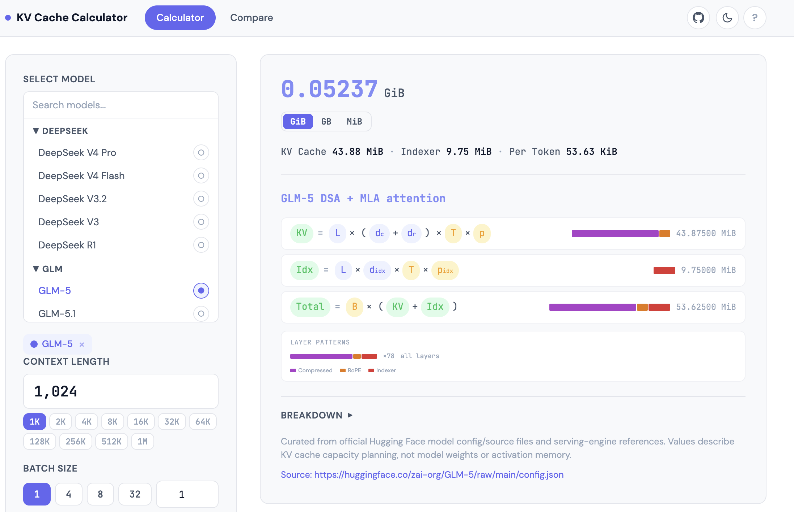
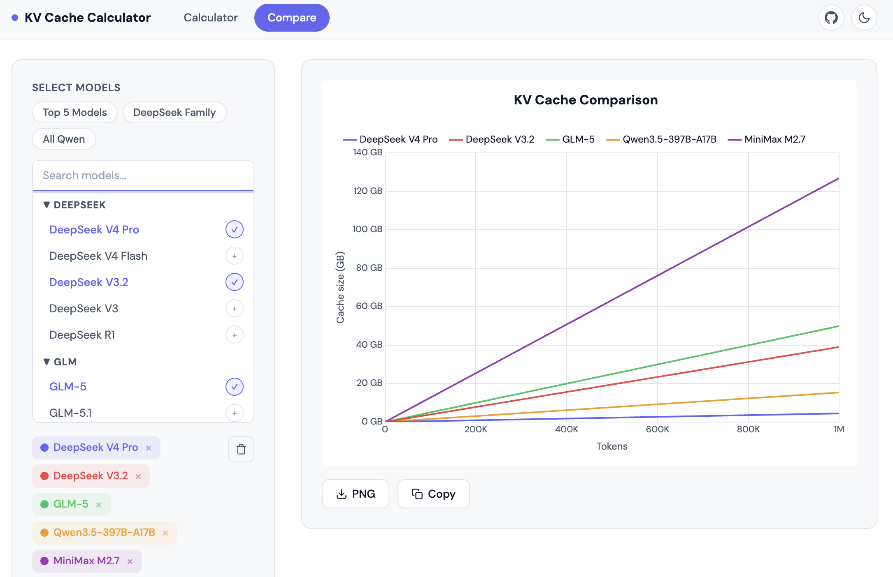

# KV Cache Calculator

A web-based tool for estimating LLM KV cache memory requirements. Supports modern architectures including MLA, GQA, hybrid attention, sliding window, and linear attention models.

**Live Demo**: [elinx.github.io/llm-mem-calculator](https://elinx.github.io/llm-mem-calculator/)

## Calculator

Calculate KV cache size for a single model with customizable parameters — context length, batch size, KV precision, and more.



## Compare

Compare KV cache memory across multiple models side-by-side with an interactive chart.



## Supported Architectures

| Architecture | Example Models |
|---|---|
| Standard GQA | Qwen3, Llama 3.x, Qwen2.5, MiniMax M2.x |
| MLA (Multi-head Latent Attention) | DeepSeek V3, DeepSeek R1, Kimi K2.5/K2.6 |
| KDA + Gated MLA (Kimi Delta Attention) | Kimi K3 |
| DSA+MLA (DeepSeek V4 Hybrid) | DeepSeek V4 Pro, DeepSeek V4 Flash, DeepSeek V3.2, GLM-5/5.1/5.2 |
| Mixed Full + Sliding Window | Gemma 4, Cohere Command, MiMo-V2.5 |
| Linear + Full Hybrid | Qwen3.5, Qwen3.6 |

## Features

- **Precision options**: BF16/FP16, FP8/INT8, FP4/INT4, and Ascend W8A8/W4A8 weight formats
- **Draft KV cache**: Account for MTP/draft model KV layers
- **Linear attention KV**: Include linear attention layer contributions
- **Context presets**: Quick-select from 1K to 1M tokens
- **Breakdown view**: Detailed per-layer KV cache breakdown
- **Formula display**: Shows the exact formula used for each model
- **Dark mode**: Toggle between light and dark themes
- **Chart export**: Download comparison charts as PNG or copy to clipboard

## Development

No build step required — just open `index.html` in a browser or serve the directory with any static file server.

```bash
# Quick local server
python3 -m http.server 8765
```

## License

MIT
