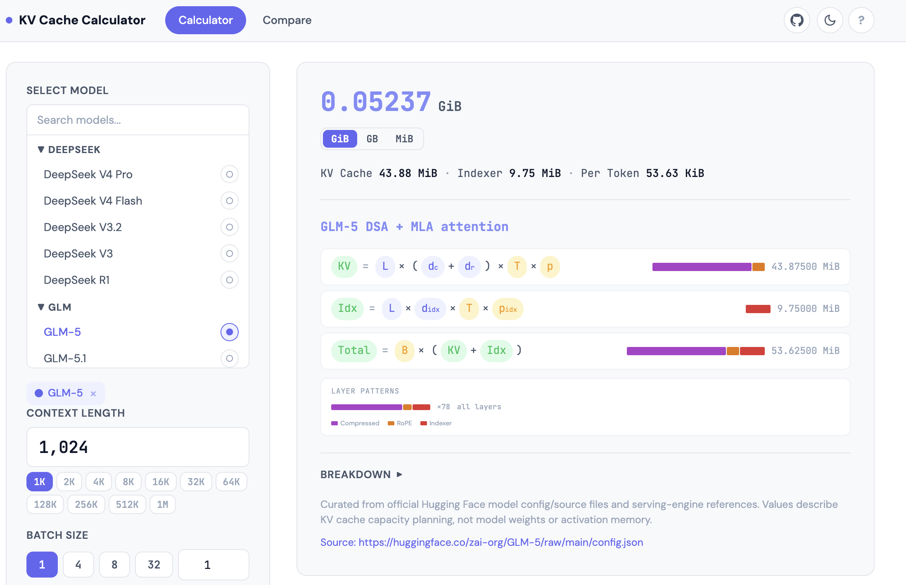
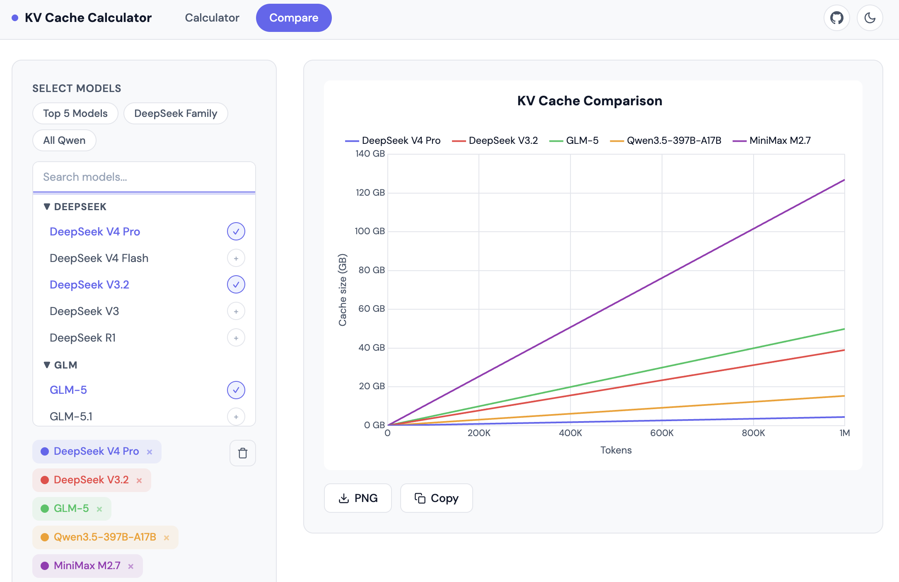

# KV Cache Calculator

A web-based tool for estimating LLM KV cache memory requirements. Supports modern architectures including MLA, GQA, hybrid attention, sliding window, and linear attention models.

**Live Demo**: [elinx.github.io/llm-mem-calculator](https://elinx.github.io/llm-mem-calculator/)

## Calculator

Calculate KV cache size for a single model with customizable parameters — context length, batch size, KV precision, and more.



## Compare

Compare KV cache memory across multiple models side-by-side with an interactive chart.



## Supported Architectures

| Architecture | Example Models |
|---|---|
| Standard GQA | Qwen3, Llama 3.x, Qwen2.5, MiniMax M2.x |
| MLA (Multi-head Latent Attention) | DeepSeek V3, DeepSeek R1, Kimi K2.5/K2.6/K2.7 Code |
| KDA + Gated MLA (Kimi Delta Attention) | Kimi K3 |
| DSA+MLA (DeepSeek V4 Hybrid) | DeepSeek V4 Pro/Pro-0813, V4 Flash/Flash-0731/Vision-Exp, DeepSeek V3.2, GLM-5/5.1/5.2/5.3 |
| CED + shared compressed KV | DeepSeek V4.1 Flash |
| KDA linear + sparse MLA | GLM-5.3-Flash |
| Mixed Full + Sliding Window | Gemma 4, Cohere Command, MiMo-V2.5 |
| Linear + Full Hybrid | Qwen3.5, Qwen3.6, Qwen3.8, Qwen AgentWorld 35B-A3B |
| GDN linear + QSA | Qwen3.8-Flash-Next |

## Features

- **Precision options**: BF16/FP16, FP8/INT8, FP4/INT4, and Ascend W8A8/W4A8 weight formats
- **Draft KV cache**: Account for MTP/DSpark draft layers separately from backbone cache ratios
- **Linear attention KV**: Include linear attention layer contributions
- **Multimodal weights**: Include auxiliary vision-tower / aligner parameters for supported multimodal checkpoints
- **Context presets**: Quick-select from 1K to 1M tokens
- **Breakdown view**: Detailed per-layer KV cache breakdown
- **Formula display**: Shows the exact formula used for each model
- **Dark mode**: Toggle between light and dark themes
- **Chart export**: Download comparison charts as PNG or copy to clipboard

## Development

No build step required — just open `index.html` in a browser or serve the directory with any static file server.

```bash
# Quick local server
python3 -m http.server 8765
```

### Cache sizing boundaries

Deployment estimates split attention KV by effective KV heads (MLA is replicated
across TP). GLM-5.3-Flash and Qwen3.8-Flash-Next linear states are split by whole
heads only when divisible by TP, and are conservatively replicated across CP.
Their single-key indexers and DeepSeek-V4.1's shared-key indexer are not divided
by query-head TP. Backend support and actual allocation must still be verified.
Qwen indexer tail layout and GLM/Qwen MTP indexer omission remain provisional;
DeepSeek cross-PP source-cache sharing requires backend support. These estimates
are not a guarantee that a given serving topology is supported or will fit.

Run regression checks with `node tests/cache-regression.cjs`.

For multimodal checkpoints, the weight/deploy pages include the auxiliary vision
encoder when the official configuration exposes it. DeepSeek V4 Flash Vision Exp
uses the official reference implementation parameterization, and Kimi K2.7 Code
uses Moonshot's published 400M Vision Encoder count. GLM-5.3-Flash and Qwen3.8
vision totals are structural estimates derived from their official vision configs;
they are marked as estimates in the UI and should be treated as planning numbers,
not serialized-checkpoint byte counts. Qwen AgentWorld checkpoints are treated as language-model-only
because the official model card states that visual component definitions exist in
the architecture but the checkpoint contains only language-model weights.

DeepSeek V4.1 Flash's official vision implementation contains a 32-layer
ViT, a two-layer aligner to 5120 hidden dimensions, and three learned image
markers (485,268,480 parameters total). They are included in GPU weight and
deploy estimates. Its Engram tables contain 196,613,849,600 FP8 values plus
scales; these external/offloaded parameters appear in the weight breakdown
but are excluded from GPU-resident weight totals. DSpark draft configuration
is tracked; the optional Draft control counts draft KV, not all draft weights.

DeepSeek V4.1 Flash global cache is owned by layers 2, 8, 14, 20. Eight
layers run indexing, but only these four store indexer K; reindexing reuses K.
With both cache precision selectors set to FP4, global storage per token is
`(3/2 + 1) × [(512/2 + 512/16) + (128/2 + 128/32)] = 890 bytes`.
The scale groups are 16 channels for main KV and 32 for indexer K.
The total also includes fixed sliding-window storage and optional Draft, so
it is not exactly 890 × tokens. Other precisions are custom payload estimates.
This is packed storage, not the BF16 dequantized buffers of the minimal
reference runtime; allocator, compressor work state and transient buffers
are not included. The 1/4 claim is not a universal same-precision total ratio.
Sources: [official implementation](https://huggingface.co/deepseek-ai/DeepSeek-V4.1-Flash/blob/main/inference/model.py),
[official model card](https://huggingface.co/deepseek-ai/DeepSeek-V4.1-Flash/blob/main/README.md).

## License

MIT
